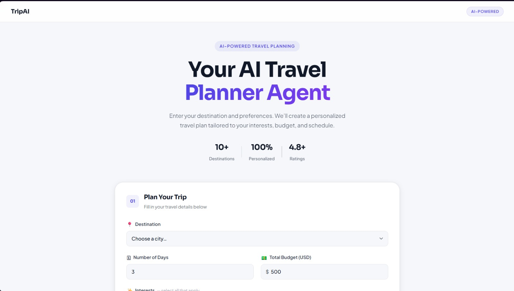
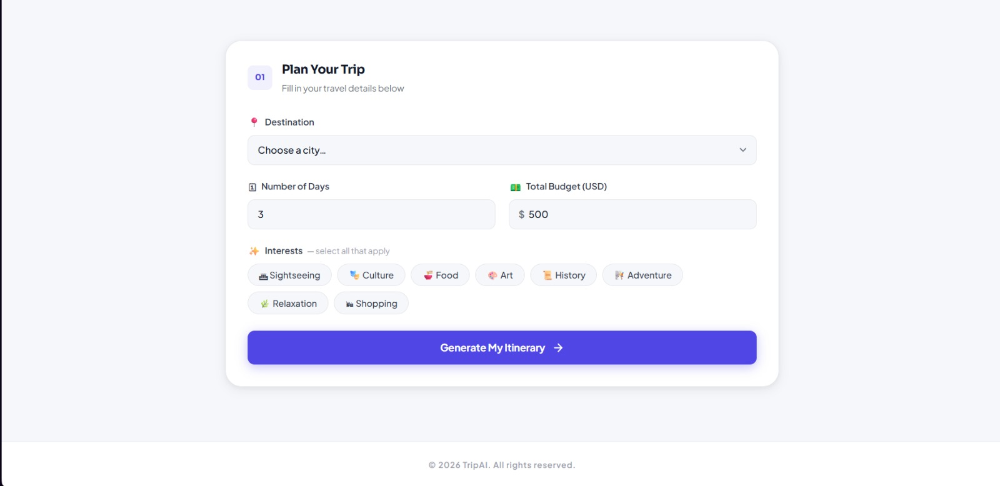

# AI-Powered Trip Planner Agent

A complete AI-powered trip planning system using **BFS**, **Greedy Best-First Search**, **CSP**, and **OpenAI API**.

---

## Project Structure

```
ai_travel_planner/
├── main.py           ← Flask app & routes
├── agent.py          ← Goal-based intelligent agent
├── search.py         ← BFS, DFS, Greedy Best-First Search
├── csp.py            ← Constraint Satisfaction Problem
├── data.py           ← Travel dataset (activities, costs, destinations)
├── api.py            ← OpenAI API integration
├── requirements.txt  ← Python dependencies
└── frontend/
    ├── index.html    ← UI layout
    ├── style.css     ← Styling (dark editorial theme)
    └── script.js     ← API calls & result rendering
```

---

## Quick Start

## Visual Overview





## AI Concepts Used

| Concept | Implementation |
|---|---|
| Intelligent Agent | `agent.py` — TravelAgent class with perceive/plan/act |
| Search Space | All possible activity combinations as states |
| BFS (Uninformed) | `search.py` — bfs_search() |
| DFS (Uninformed) | `search.py` — dfs_search() |
| Greedy BFS (Informed) | `search.py` — greedy_best_first_search() with heuristic |
| Heuristic Function | Interest relevance + cost efficiency score |
| CSP Constraints | `csp.py` — budget + duration enforcement |
| Prompt Engineering | `api.py` — structured prompt to OpenAI |

---

## Sample Test Case

**Input:**
- Destination: Paris
- Days: 3
- Budget: $600
- Interests: art, food, culture

**Expected Output:**
- 3-day itinerary respecting $600 budget
- Activities from: Louvre, Seine Cruise, Cooking Class, etc.
- AI-narrated day-by-day plan

---

## Extending the Project

- Add more destinations in `data.py`
- Tune `activities_per_day` in search calls (default: 3)
- Improve heuristic in `search.py → heuristic()`
- Add export to PDF feature
